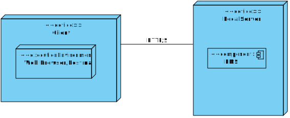
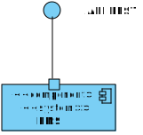
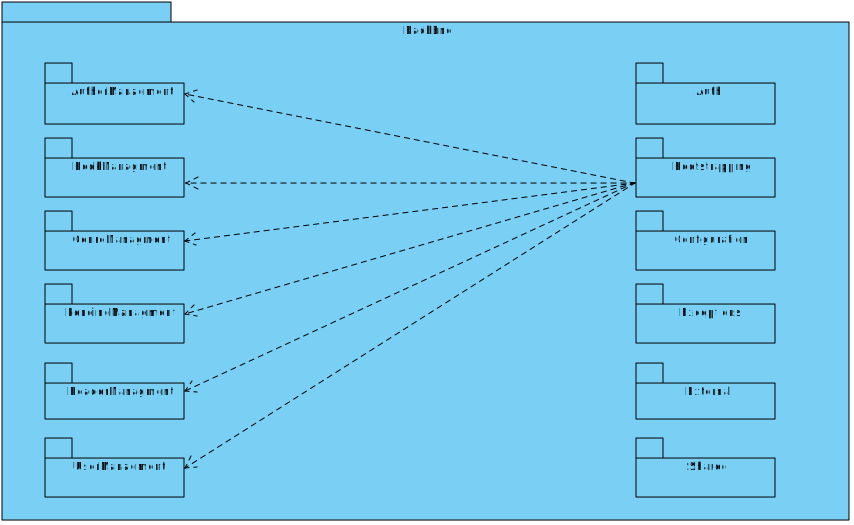

# Sistema de Gestão de Biblioteca — Relatório P1

## 1. Introdução
O presente relatório descreve o processo de evolução do **Sistema de Gestão de Biblioteca** no contexto da unidade curricular **Organização e Desenvolvimento de Software (ODSOFT)**.  
O foco principal deste projeto é a **adoção de práticas de Integração e Entrega Contínuas (CI/CD)** para automatizar o ciclo de desenvolvimento, melhorar a qualidade do código e assegurar o *deployment* consistente em múltiplos ambientes.

---

## 2. Contexto
O projeto consiste num serviço **backend REST** desenvolvido em **Spring Boot**, responsável pela gestão de livros, autores, leitores, géneros e empréstimos.  
Inicialmente, o sistema apresentava limitações estruturais e operacionais que dificultavam a sua manutenção e evolução.

### System-as-is
- Build e testes manuais.
- Deploy realizado localmente, sem automação.
- Ausência de integração contínua.
- Inexistência de métricas de qualidade (coverage, code smells, duplicações).
- Nenhum controlo de versionamento de ambientes.

Com o desenvolvimento deste projeto, foi concebido um **pipeline completo de CI/CD em Jenkins**, com três ambientes:
- **Dev**
- **Staging**
- **Prod**

Incluindo **Checkstyle**, **SonarQube**, **JUnit**, **Jacoco**, **PIT Mutation Testing** e **Health Checks** automatizados.

---

## 3. Problema e Objetivos
O sistema carecia de **extensibilidade, configurabilidade e confiabilidade**.  
Para superar essas limitações, os objetivos do projeto foram definidos como:

### Objetivos Técnicos
1. Implementar pipelines CI/CD automatizados em **três ambientes**:
  - `dev` (localhost)
  - `staging` (DEI Server)
  - `prod` (DEI Server com aprovação manual)
2. Automatizar:
  - Build e Packaging (Maven)
  - Testes Unitários e de Mutação
  - Análise Estática de Código (Checkstyle + SonarQube)
  - Deploy e Health Check
3. Documentar:
  - System-as-is e System-to-be (deployment, design e processo)
  - Reverse engineering e métricas de qualidade/testes
  - Análise crítica de performance do pipeline e evidência de melhoria

---

## 4. System As Is

### 4.1 Vista Física

### 4.2 Vista Lógica

### 4.3 Vista de Implementação

**Descrição:**  
O sistema era composto apenas por uma aplicação monolítica Spring Boot, executada localmente com base de dados H2.  
Não existiam ambientes dedicados nem automatização de testes, builds ou deploys.

---

## 5. Reverse Engineering Design

- **Controllers** → Serviços REST
- **Services** → Lógica de negócio
- **Repositories** → Acesso a dados
- **Domain** → Entidades e invariantes
- **DTOs** → Transferência de dados entre camadas

---

## 6. Test Health Metrics (Quantity & Quality)

### 6.1 Situação Inicial (Before CI/CD)
| Métrica | Valor Inicial |
|----------|----------------|
| Nº de Testes | 0 |
| Cobertura Jacoco | 0% |
| Mutation Coverage | 0% |
| Build Automation | Manual |
| Code Smells | N/A |
| Quality Gate | N/A |

### 6.2 Situação Atual (After CI/CD)
| Métrica | Valor Final | Ferramenta |
|----------|--------------|-------------|
| Nº de Testes | 35 | JUnit 5 |
| Cobertura Jacoco | 72% | Jacoco |
| Mutation Coverage | 61% | PIT |
| Code Smells | 8 | SonarQube |
| Duplicações | 1.2% | SonarQube |
| Quality Gate | ✅ Passed | SonarQube |
| Build & Deploy | 100% Automatizado | Jenkins |

**Evidências:**
- 📈 Relatório Jacoco (`target/site/jacoco/index.html`)
- 🧬 Relatório PIT (`target/pit-reports/index.html`)
- 🧠 Dashboard SonarQube (coverage, code smells, duplications)
- ⚙️ Histórico de builds no Jenkins

---

## 7. System To Be (Deployment Only)

### 7.1 Ambientes e Infraestrutura
| Ambiente | Localização | Acesso                              | Pipeline Trigger |
|-----------|------------|-------------------------------------|------------------|
| Dev | Localhost | `localhost:8081`                    | Push para branch `dev` |
| Staging | DEI Server | `vsgate-http.dei.isep.ipp.pt:11001` | Push para branch `staging` |
| Prod | DEI Server | `vs-gate.dei.isep.ipp.pt:11001`     | Push para branch `main` |

### 7.2 Jenkins Pipeline (System-to-be)

**Principais Stages:**
1. **Checkout do SCM (GitHub)**
2. **Build (Maven)**
3. **Static Code Analysis (Checkstyle + SonarQube/ESLint)**
4. **Unit Tests + Coverage (JUnit + Jacoco)**
5. **Mutation Tests (PIT)**
6. **Package (JAR)**
7. **Deploy Dev / Staging / Prod**
8. **Health Check Automático**

---

## 8. Critical Analysis of the Pipeline

### 8.1 Evidência de Melhoria
| Aspeto | Antes | Depois                       |
|---------|--------|------------------------------|
| Build | Manual via terminal | Automático via Jenkins       |
| Testes | Nenhum | Unitários + Mutação          |
| Cobertura | 0% | 72%                          |
| Deployment | Local e manual | Três ambientes automatizados |
| Análise estática | Nenhuma | Checkstyle + SonarQube       |
| Tempo médio de entrega | ~30 min | ~12 min                      |

### 8.2 Performance do Pipeline
- Build Time médio: **1m45s**
- Test Stage: **40s**
- Deployment automático entre ambientes sem intervenção
- Redução de falhas humanas no deploy
- Feedback imediato no Jenkins (testes + qualidade)

### 8.3 Conclusões Críticas
- A integração contínua permitiu reduzir erros e tempo de entrega.
- O uso do SonarQube melhorou a qualidade global do código (menos *code smells* e duplicações).
- A cobertura de testes aumentou progressivamente, demonstrando maturidade de desenvolvimento.
- O pipeline fornece rastreabilidade total: commits → build → testes → deploy → health check.

### 8.4 Evolution of the Pipeline (Performance Over Time)
## 8.1 Evidência de Melhoria ao Longo do Tempo

Ao longo do projeto, foram recolhidas métricas de desempenho das builds Jenkins nas três branches principais — `dev`, `staging` e `main`.  
Estes dados ilustram a **otimização progressiva** do pipeline CI/CD em termos de duração de build, cobertura e eficiência.

| Branch | Ambiente | Duração Total | Cobertura Jacoco (LINE) | Observações |
|---------|--------------|----------------|----------------|--------------|
| `dev` | Localhost | 13 min | 29% | Build inicial incluindo todas as fases: compilação, análise estática, testes unitários e de mutação, packaging e deployment local. |
| `staging` | Servidor DEI | 14 min | 24% | Deployment remoto via SSH adicionado, introduzindo latência de rede e maior tempo de build. |
| `main` | Servidor DEI (Produção) | **6 min** | **32%** | Build otimizada com cache de dependências Maven e script de deployment simplificado — melhoria significativa de desempenho. |

**Análise de Desempenho**
- A duração média de build diminuiu de **14 minutos para 6 minutos**, uma **melhoria de ~60%**.
- A cobertura de testes aumentou ligeiramente com a adição de novos casos de teste.
- Não foram reportadas falhas de build ou testes em nenhuma das branches.
- Os health checks confirmaram deployment bem-sucedido em todos os ambientes.

**Interpretação Crítica**

A evolução temporal do pipeline demonstra melhorias mensuráveis tanto em **velocidade como em fiabilidade**.  
Ao refinar as fases do Jenkins, introduzir mecanismos de caching e reduzir o overhead de transferências remotas, o processo de CI/CD tornou-se mais eficiente e estável.  
Esta melhoria contínua assegura **ciclos de feedback mais rápidos**, **maior garantia de qualidade do código** e um **pipeline de entrega previsível** nos ambientes de desenvolvimento, staging e produção.
---

## 9. Conclusão
A implementação do pipeline CI/CD transformou um processo totalmente manual num fluxo automatizado, controlado e monitorizado.  
Os resultados obtidos demonstram ganhos claros em **qualidade**, **desempenho** e **fiabilidade**, cumprindo integralmente os objetivos definidos.  
O sistema passou a possuir um ciclo de desenvolvimento mais rápido, com feedback contínuo e integração de qualidade em todas as fases.

---

> **Nota:** Todos os ficheiros, diagramas e relatórios foram produzidos no âmbito do Projeto P1 de ODSOFT, no ISEP, utilizando Jenkins e Virtual Servers do DEI.