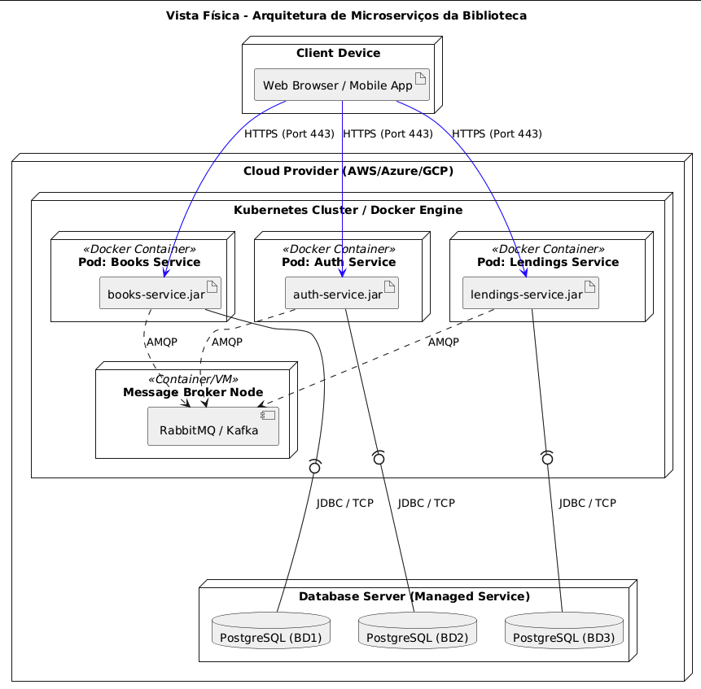
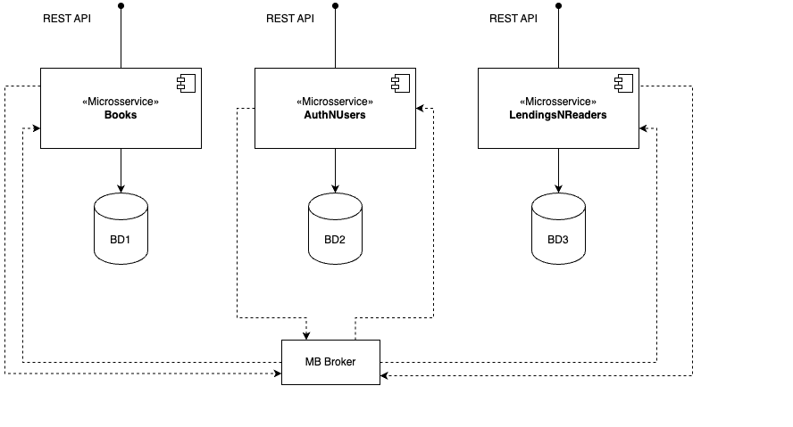
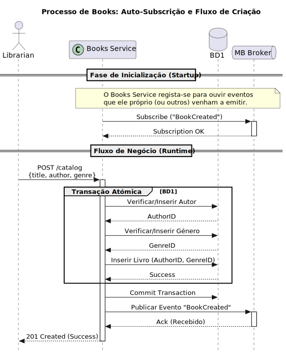
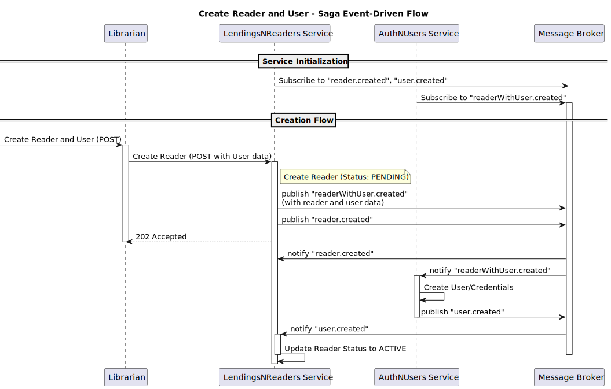

# Relatório do Sistema de Gestão de Biblioteca - Segunda Iteração

## Introdução

Este relatório apresenta o estado atual e a visão futura do nosso Sistema de Gestão de Biblioteca, focando na reengenharia da aplicação para adotar uma arquitetura descentralizada/distribuída. O objetivo é melhorar o desempenho, disponibilidade, escalabilidade e elasticidade do sistema.

## Contexto

No projeto anterior, a aplicação LMS foi desenvolvida e questões de configurabilidade, confiabilidade e extensibilidade foram abordadas. No entanto, a arquitetura centralizada (monolítica ou monolítica modular) limita o desempenho, disponibilidade, escalabilidade e elasticidade do sistema.

## Problema

A arquitetura atual do sistema apresenta as seguintes limitações:

- Desempenho insuficiente em alta procura
- Disponibilidade limitada
- Escalabilidade e elasticidade restritas

## Objetivos

Os objetivos deste projeto (P2) são:

### Melhorar a arquitetura do sistema para

- Adotar uma arquitetura descentralizada/distribuída
- Melhorar a disponibilidade do sistema
- Aumentar o desempenho em 25% durante alta procura (>Y requisições/tempo)
- Utilizar hardware de forma dinâmica, ajustando-se à procura do sistema
- Manter ou melhorar a capacidade de lançamento de novas versões
- Garantir que os clientes de software não sejam afetados por mudanças na API, exceto em casos extremos
- Aderir à estratégia SOA da empresa de conectividade orientada por API

### Atender aos requisitos funcionais:

- Como bibliotecário, quero criar um Livro, Autor e Gênero no mesmo processo.
- Como bibliotecário, quero criar um Reader e o respetivo User no mesmo processo.

---

## Requisitos Não-Funcionais

- Melhorar a disponibilidade do sistema.
- Aumentar o desempenho em 25% durante alta procura.
- Utilizar hardware de forma eficiente.
- Manter ou melhorar a capacidade de lançamento de novas versões.
- Garantir compatibilidade com clientes de software existentes.
- Aderir à estratégia SOA da empresa.

## Requisitos Funcionais

- Criação de Livro, Autor e Gênero em um único processo.\
  **( Por favor ler [book-author-genre.md](fr/book-author-genre.md) para mais detalhes)**
- Sugestão de aquisição de novos Livros por leitores.
- Recomendação de Livros por leitores ao devolver.

---

## Alternativas de Arquitetura

Para a implementação da nova arquitetura, foram consideradas diferentes alternativas, com foco numa abordagem descentralizada/distribuída.

### Arquitetura Descentralizada/Distribuída

A nova arquitetura visa dividir a aplicação em serviços menores e independentes, permitindo maior flexibilidade e escalabilidade através da utilização de microserviços.

#### Benefícios

- **Escalabilidade**: Cada microserviço pode ser escalado independentemente, permitindo que o sistema lide eficientemente com aumentos de carga.
- **Flexibilidade**: Facilita a adoção de novas tecnologias e a implementação de mudanças sem impactar o sistema como um todo.
- **Resiliência**: Falhas num serviço não afetam necessariamente os outros, aumentando a disponibilidade geral do sistema.
- **Desenvolvimento Ágil**: Equipas podem trabalhar em diferentes serviços simultaneamente, acelerando o ciclo de desenvolvimento.

#### Desafios

- **Complexidade de Gestão**: Aumenta a complexidade operacional, exigindo ferramentas robustas para orquestração e monitoramento.
- **Comunicação entre Serviços**: Requer a implementação de mecanismos eficientes de comunicação (no caso, RabbitMQ) e coordenação entre microserviços.
- **Consistência de Dados**: Manter a consistência dos dados pode ser desafiador, especialmente em sistemas distribuídos.

Esta abordagem visa não apenas resolver as limitações da arquitetura atual, mas também preparar o sistema para futuras expansões e adaptações tecnológicas.

---

## Diagramas e Conceitos

### Vista Física

A vista física do sistema ilustra a distribuição dos microserviços e a infraestrutura subjacente. Cada microserviço é implantado em contêineres Docker, orquestrados por Kubernetes, garantindo escalabilidade e resiliência. A comunicação entre os microserviços é facilitada por um broker RabbitMQ, que gerencia as filas de mensagens.

### Vista Lógica

A vista lógica detalha os principais microserviços que compõem o sistema.

### Vista Processos - Criação de Book, Author e Genre

### Comunicação entre Microserviços via AMQP

Os microserviços comunicam entre si utilizando o protocolo AMQP (Advanced Message Queuing Protocol), que permite a troca de mensagens de forma assíncrona e eficiente. Este método de comunicação é essencial para garantir a escalabilidade e a resiliência do sistema.

### Padrão SAGA

O padrão SAGA é uma solução de arquitetura para gerir transações distribuídas em sistemas de microserviços, onde não é possível utilizar transações ACID tradicionais devido ao isolamento das bases de dados (Database per Service). Em vez de uma única transação gigante, uma Saga divide o processo numa sequência de transações locais: cada microserviço executa a sua parte e emite um evento que despoleta a ação seguinte.
A utilização deste padrão no Requisito Funcional 2 justifica-se pela necessidade de garantir a integridade entre dois domínios distintos que vivem em serviços separados:

- Separação de Domínios: O conceito de "Leitor" pertence ao microserviço LendingsNReaders (BD3), enquanto as credenciais de acesso pertencem ao AuthNUsers (BD2).

- Consistência Eventual: Como não podemos forçar uma escrita única em duas bases de dados diferentes ao mesmo tempo, a Saga garante que, se a criação do utilizador falhar no serviço de autenticação, o sistema "volta atrás" e anula a criação do leitor, mantendo o sistema num estado consistente.

### Padrão Strangler fig

A migração do sistema foi abordada através do Strangler Fig Pattern, permitindo uma transição gradual e controlada. Em vez de uma substituição total e imediata ("Big Bang"), as novas funcionalidades (como os serviços de Books, Auth e Lendings) foram implementadas como microserviços independentes que "estrangulam" gradualmente as responsabilidades do sistema antigo.

### Padrão Database per Service

Para garantir o desacoplamento total, foi aplicado o padrão Database per Service. Cada microserviço possui a sua própria base de dados persistente e exclusiva (ex: BD1 para Books, BD2 para Auth), assegurando que as alterações no esquema de dados de um serviço não impactam diretamente os outros

### Padrões de Messaging e Domain Events

A comunicação entre microserviços é realizada através de mensagens assíncronas utilizando RabbitMQ. Este padrão permite que os serviços sejam independentes e escaláveis, respondendo a eventos do domínio sem acoplamento direto.

---
## Technical Memos

Os _technical memos_ fornecem uma visão detalhada das soluções propostas para os problemas identificados no sistema atual. Eles incluem:

- **[Transição da Arquitetura](technical-memos/architectureTransition.md)**: Detalha a migração para uma arquitetura de microserviços para melhorar a escalabilidade e a manutenção.
- **[Criação de Livro, Autor e Gênero](technical-memos/MultipleCreationBookAggregate.md)**: Processo unificado para criar as 3 entidades numa única operação.

## Quality Attribute Scenarios

Os cenários de atributos de qualidade definem os requisitos de qualidade que o sistema deve atender. Cada cenário é projetado para garantir que o sistema atenda aos objetivos de desempenho, usabilidade e modifiability.

- **[Transição da Arquitetura](QAS/QAS1-ArchitectureTransition.md)**: Foco na Modifiability para facilitar a migração para microserviços. Este cenário garante que o sistema possa ser facilmente adaptado a novas tecnologias e requisitos, minimizando o tempo e o custo de manutenção.

- **[Criação de Livro, Autor e Gênero](QAS/QAS2-MultipleCreationBookAggregate.md)**: Foco na Usability para integrar a criação dessas entidades num único processo. Pretende-se reduzir significativamente o tempo necessário para introdução das informações de novos livros, promovendo uma gestão mais eficiente do catálogo da biblioteca.

## Conclusão

A reengenharia da aplicação para uma arquitetura descentralizada/distribuída visa resolver as limitações da arquitetura atual, melhorando o desempenho, disponibilidade, escalabilidade e elasticidade do sistema, enquanto atende aos requisitos funcionais e não-funcionais definidos.
