# Sistema de Gestão de Biblioteca - Relatório P1

## Introdução
O presente documento descreve a situação atual e as perspetivas futuras de um Sistema de Gestão de Biblioteca, uma solução desenvolvida para atualizar e tornar mais eficientes os processos internos da biblioteca. O objetivo central é proporcionar uma experiência mais ágil tanto para os colaboradores como para os utilizadores, potenciando a eficácia das operações por meio da digitalização.

## Contexto
No projeto anterior, foi desenvolvido um serviço backend orientado a REST para Gestão de Bibliotecas. Esta aplicação fornece endpoints REST para gerir:

- Livros
- Géneros
- Autores
- Leitores
- Empréstimos

## Problema
O serviço de Gestão de Biblioteca não suporta:

- Extensibilidade
- Configurabilidade
- Confiabilidade

## Objetivos
Os objetivos deste projeto (P1) são:

### Desenvolver uma solução para:

- Persistir dados em diferentes modelos de dados (e.g., relacional, documento) e SGBDs: 
  - (i) SQL + Redis 
  - (ii) MongoDB+Redis
- Procurar o ISBN de um livro pelo título do mesmo através de diferentes sistemas externos:
  - (i) ISBNdb
  - (ii) Google Books API
- Gerar IDs de várias entidades em diferentes formatos de acordo com especificações variadas
- As alternativas anteriores devem ser aplicadas em tempo de setup por meio de configuração

### Documentar:

- System as Is (reverse engineering de design)
- Requisitos, especialmente ASR (Requisitos Arquiteturais de Software)
- Alternativas de design arquitetónico e racionais
- Táticas
- Arquiteturas de referência
- Padrões

### Melhorar os testes funcionais:

- Testes de Caixa-opaca com SUT = classes
- Testes de Caixa-transparente com SUT = classes de domínio
- Testes de mutação com SUT = classes
- Testes de Caixa-opaca funcional com SUT = controlador + serviço + {domínio, repositório, gateways}
- Testes de Caixa-opaca funcional com SUT = sistema

## Acerca dos requisitos

##### Quality attribute scenarios
- [Scenario 1 - Persistência de Dados](QAS/PersistingData-QAS.md)
- [Scenario 2 - Pesquisa de ISBNs através de APIs externas](QAS/SearchISBN-QAS.md)
- [Scenario 3 - Geração de IDs em diferentes formatos](QAS/IdGeneration-QAS.md)

## System As Is

### Vista física
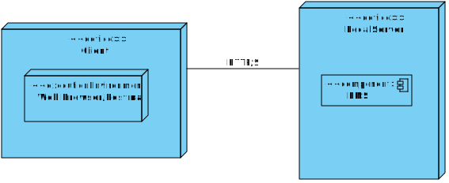

### Vista lógica
#### Nivel 1
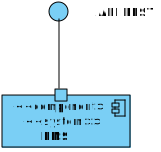

#### Nivel 2
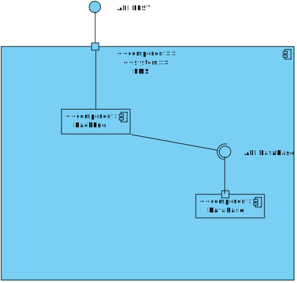

#### Nivel 3
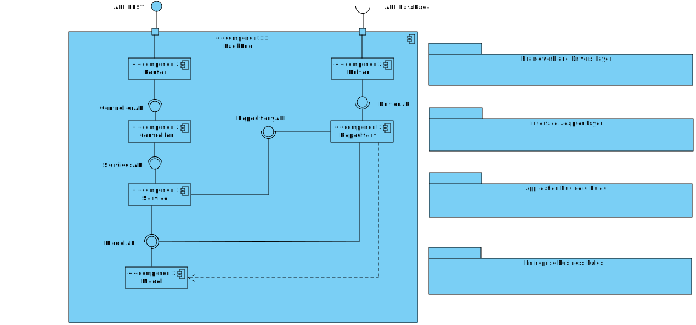

### Vista de implementação

#### Nivel 1

#### Nivel 2
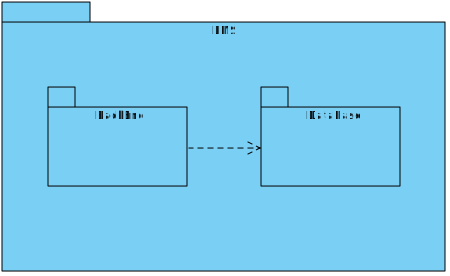

#### Nivel 3
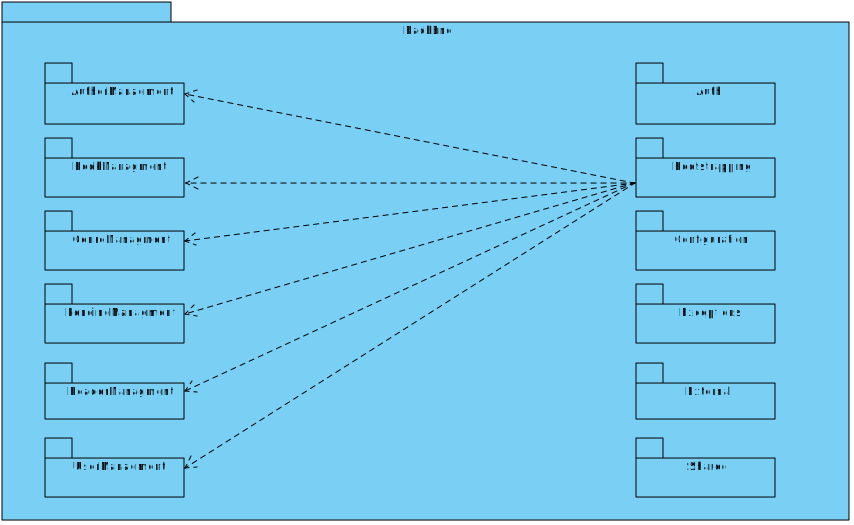

#### Nivel 4
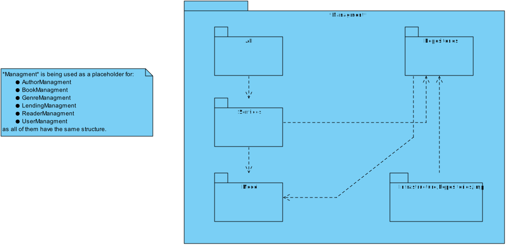

## System To Be

### Vista física
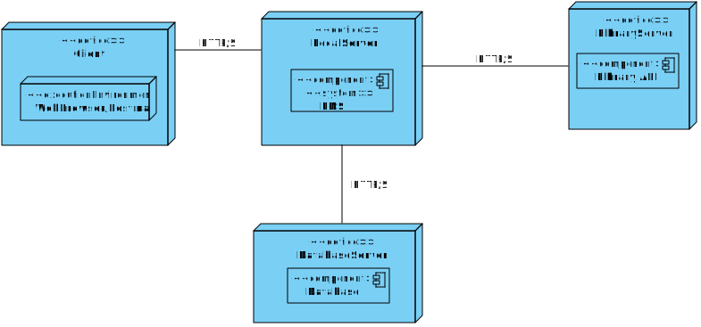

### Vista lógica
#### Nivel 1
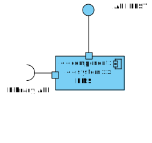

#### Nivel 2

#### Nivel 3

### Vista de Processos

#### Nivel 1 - Create Book Process
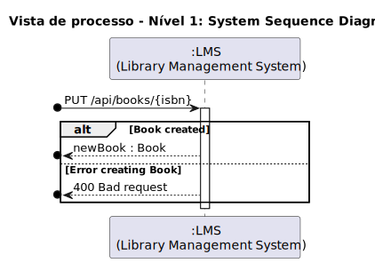

#### Nivel 2 - Create Book Process

#### Nivel 3 - Create Book Process
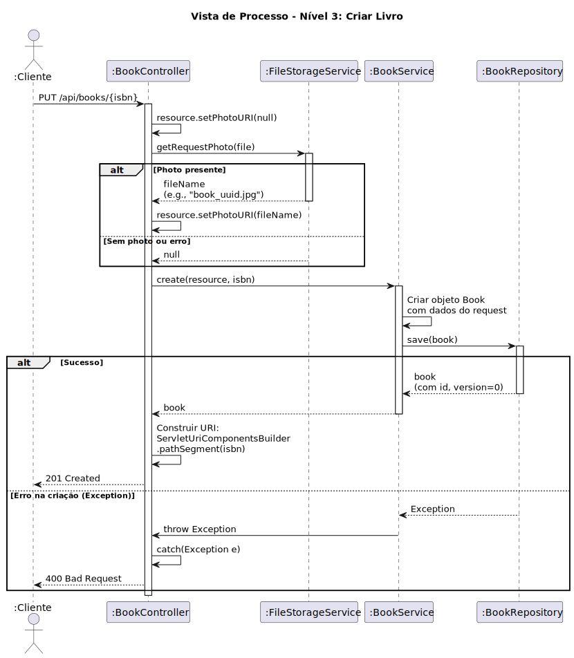

#### Nivel 4 - Create Book Process

#### Nivel 1 - IsbnSearch Process

#### Nivel 2 - IsbnSearchProcess

#### Nivel 3 - IsbnSearch Process
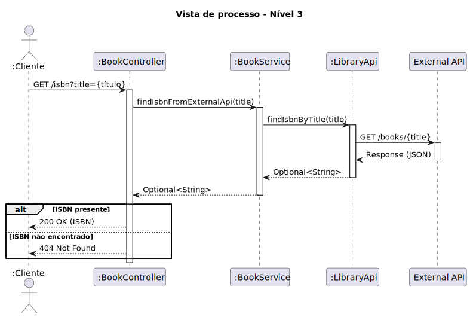

#### Nivel 4 - IsbnSearch Process

#### DISCLAIMER
No âmbito da arquitetura SAI e STB, não foi representada a Ninja API, uma vez que esta corresponde a um serviço externo ao processo de desenvolvimento e não faz parte do código ou infraestrutura sob responsabilidade da equipa. 
Para complementar a descrição estrutural, foram elaboradas vistas de processo, que detalham os principais fluxos funcionais impactados pelos novos requisitos, nomeadamente a pesquisa de ISBN através de sistemas externos e a geração de identificadores (IDs) em múltiplos formatos. Estas vistas permitem compreender como os componentes do sistema interagem dinamicamente para satisfazer os novos cenários funcionais.
---

## Requisitos e Soluções Arquiteturais

Nesta secção são apresentadas as soluções arquiteturais desenvolvidas para satisfazer os três requisitos críticos do projeto P1. Cada requisito é fundamentado através de um **Technical Memo** que documenta o problema, a análise de táticas de modificabilidade e as alternativas consideradas, acompanhado de **diagramas de componentes** que ilustram a arquitetura resultante.

### 1. Geração de IDs em Múltiplos Formatos

#### Problema e Contexto
O sistema necessita de gerar identificadores únicos para diferentes entidades (Book, Genre) utilizando múltiplos formatos, permitindo a seleção da estratégia de geração em tempo de configuração (setup-time) através de Spring Profiles. A solução deve garantir flexibilidade, extensibilidade e isolamento do domínio.

#### Technical Memo
O documento [Technical Memo - Geração de Ids](technical-memos/IdGeneration.md) detalha:

- **Problema**: Necessidade de um sistema flexível para geração de identificadores únicos com diferentes estratégias
- **Solução**: Implementação de uma interface `IdGenerator` com múltiplas implementações selecionáveis por Profile
- **Táticas de Modificabilidade Aplicadas**:
    - **Encapsular** (Reduce Coupling): Isolação da lógica de geração em módulos independentes
    - **Intermediário** (Use an Intermediary): Factories (BookFactory, GenreFactory) como intermediárias
    - **Abstrair Serviços Comuns** (Abstract Common Services): Interface comum `IdGenerator`
    - **Adiar Vinculação** (Defer Binding): Seleção da implementação via Spring Profiles em setup-time

- **Alternativas Consideradas**: Geração direta no domínio, Service centralizado com lógica condicional

#### Arquitetura de Componentes
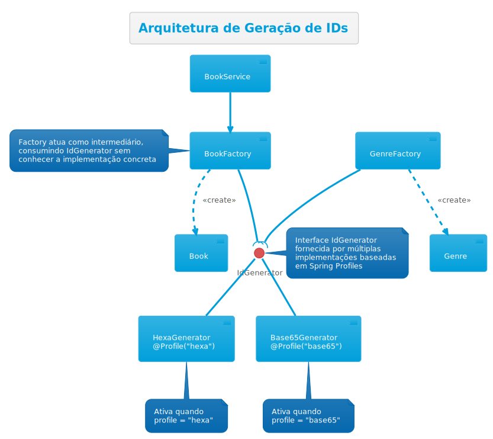

A arquitetura utiliza o **Strategy Pattern** onde:
- A interface `IdGenerator` define o contrato comum
- Implementações (HexaGenerator, Base65Generator) fornecem estratégias distintas
- Factories consomem a interface sem conhecer a implementação concreta
- Spring Profiles ativam a implementação apropriada conforme o ambiente

### 2. Pesquisa de ISBN através de APIs Externas

#### Problema e Contexto
O sistema necessita de obter o ISBN de um livro através do seu título, consultando diferentes APIs externas (ISBNdb, Google Books)

#### Technical Memo
O documento [Technical Memo - Procura de ISBN por Título via APIs Externas](technical-memos/IsbnSearch.md) detalha:

- **Problema**: Integração flexível com múltiplas APIs externas com diferentes formatos, políticas de autenticação e rate limits
- **Solução**: Serviço de lookup de ISBN configurável que orquestra consultas a diferentes APIs, agregando e validando resultados
- **Táticas de Modificabilidade e Disponibilidade Aplicadas**:
    - **Encapsular** (Reduce Coupling): Isolação de cada integração com API em módulos independentes
    - **Intermediário** (Use an Intermediary): BookService orquestra as chamadas às APIs externas
    - **Abstrair Serviços Comuns** (Abstract Common Services): Interface comum `LibraryApi` com normalização de respostas
    - **Adiar Vinculação** (Defer Binding): Configuração dinâmica das APIs ativas através de Spring Profiles

- **Alternativas Consideradas**: Catálogo local sincronizado, integração direta no Controller, biblioteca genérica única

#### Arquitetura de Componentes
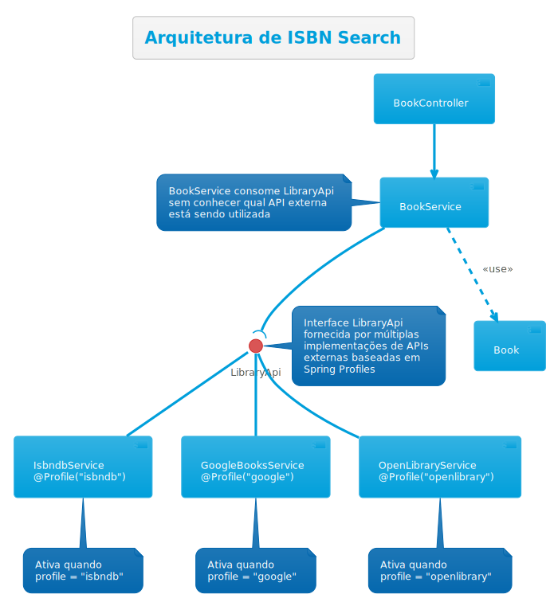

A arquitetura utiliza o **Strategy Pattern** onde:
- A interface `LibraryApi` define o contrato comum
- Implementações (IsbndbService, GoogleBooksService, OpenLibraryService) fornecem integração com APIs distintas
- BookService consome a interface orquestrando as buscas
- Spring Profiles selecionam qual API utilizar em tempo de deploy

### 3. Persistência em Múltiplos SGBDs

#### Problema e Contexto
O sistema necessita de suportar múltiplos modelos de dados e SGBDs (SQL com Redis, MongoDB com Redis), permitindo a seleção em tempo de configuração sem modificar a lógica de negócio. A solução deve manter o isolamento do domínio e permitir troca de persistência com mínimo impacto.

#### Technical Memo
O documento [Technical Memo - Persistência Multi-SGBD](technical-memos/DatabaseConfig.md) documentaria:

- **Problema**: Suportar múltiplos SGBDs com diferentes modelos de dados e padrões de persistência
- **Solução**: Interface `IRepository` com implementações específicas (SQLRepository, MongoRepository) e Mappers (SQLMapper, MongoMapper) para conversão domínio ↔ data models
- **Táticas de Modificabilidade Aplicadas**:
    - **Encapsular** (Reduce Coupling): Isolação de cada implementação de persistência
    - **Intermediário** (Use an Intermediary): Repositories como intermediários entre Service e Data Models
    - **Abstrair Serviços Comuns** (Abstract Common Services): Interface `IRepository` e `Mapper` comuns
    - **Adiar Vinculação** (Defer Binding): Seleção via Spring Profiles (@Profile("sql") vs @Profile("mongo"))

- **Alternativas Consideradas**: Lógica de persistência no Service

#### Arquitetura de Componentes

A arquitetura utiliza o **Strategy Pattern** onde:
- Interfaces `IRepository` e `Mapper` definem contratos comuns
- Implementações específicas (SQL, Mongo) fornecem estratégias de persistência distintas
- Data Models (SQLEntity, MongoDocument) contêm anotações específicas do SGBD
- Mappers convertem entre objetos de domínio puros e data models
- Spring Profiles selecionam qual SGBD utilizar em tempo de setup

### Padrão Arquitetural Unificado

As três soluções seguem um **padrão coesivo** aplicado consistentemente:

| Aspecto                   | ID Generation                                           | ISBN Search                                             | Persistence                                             |
|---------------------------|---------------------------------------------------------|---------------------------------------------------------|---------------------------------------------------------|
| **Interface Abstrata**    | `IdGenerator`                                           | `LibraryApi`                                            | `IRepository`, `Mapper`                                 |
| **Padrão de Design**      | Strategy                                                | Strategy                                                | Strategy                                                |
| **Vinculação**            | Setup-time (Profiles)                                   | Setup-time (Profiles)                                   | Setup-time (Profiles)                                   |
| **Táticas Aplicadas**     | Encapsulation, Intermediary, Abstraction, Defer Binding | Encapsulation, Intermediary, Abstraction, Defer Binding | Encapsulation, Intermediary, Abstraction, Defer Binding |
| **Isolamento de Domínio** | ✓ Domain puro                                           | ✓ Domain puro                                           | ✓ Domain puro                                           |
| **Testabilidade**         | ✓ Fácil mock/stub                                       | ✓ Fácil mock/stub                                       | ✓ Fácil mock/stub                                       |
| **Extensibilidade**       | ✓ Novas implementações sem modificação                  | ✓ Novas APIs sem modificação                            | ✓ Novos SGBDs sem modificação                           |
---
## Alternativas de Arquitetura para uma aplicação de Gestão de Biblioteca

Para a implementação da aplicação de Gestão de Biblioteca, foram consideradas diferentes alternativas arquiteturais, sendo o padrão MVC (Model-View-Controller) uma das principais opções avaliadas.

### MVC
O padrão MVC é uma arquitetura que separa a aplicação em três componentes principais: 
- Model (responsável pelos dados e regras de negócio) 
- View (interface com o usuário) 
- Controller (intermediário que processa as entradas e coordena Model e View) 

Esta separação permite maior organização do código, facilita a manutenção e possibilita a reutilização de componentes.

#### Comunication
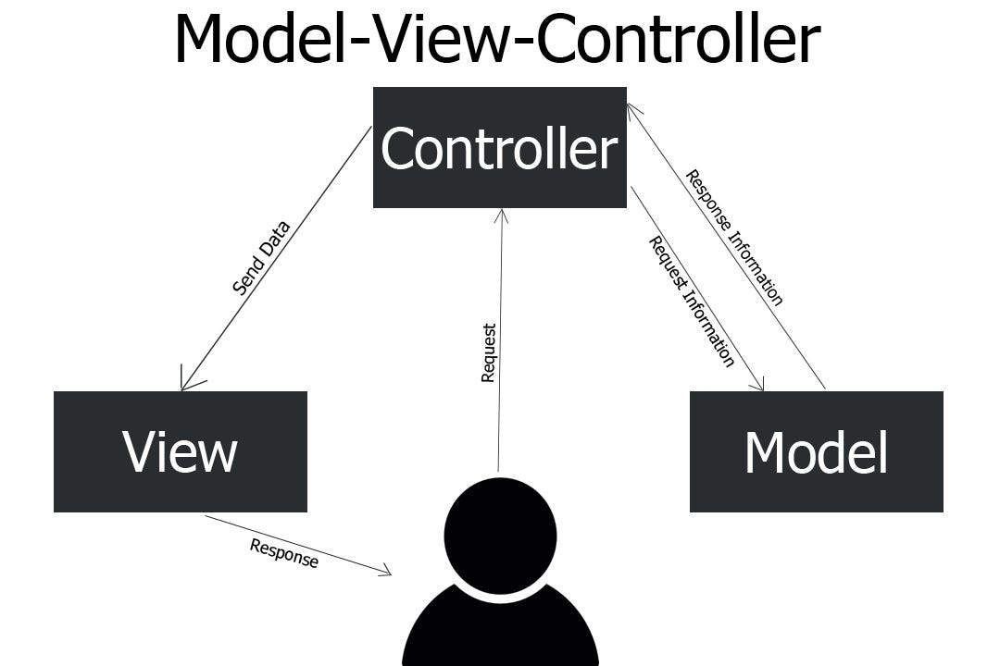

#### Simple Class Diagram
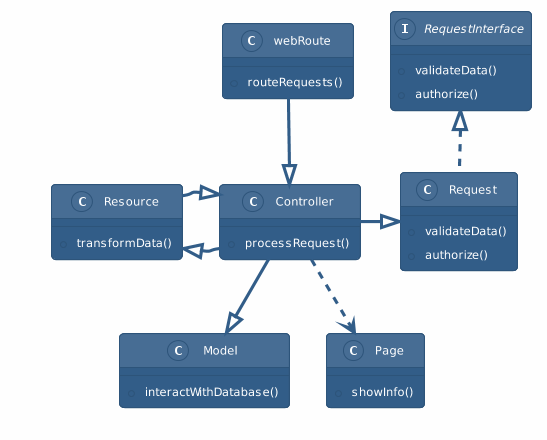

#### Package Diagram
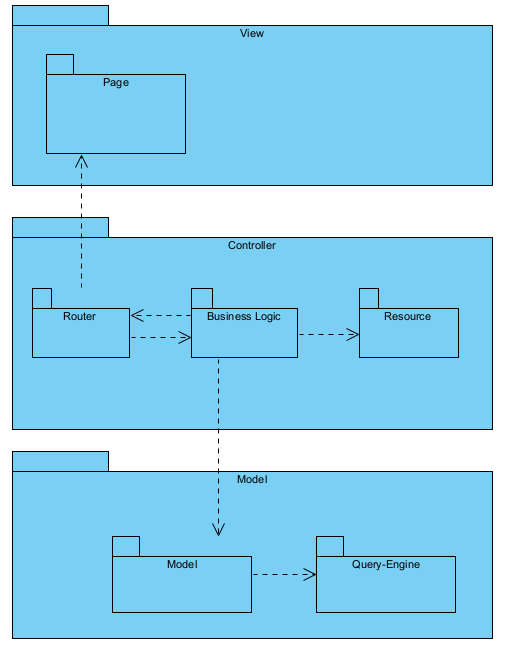